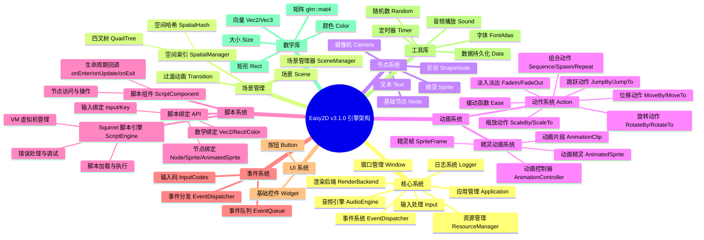
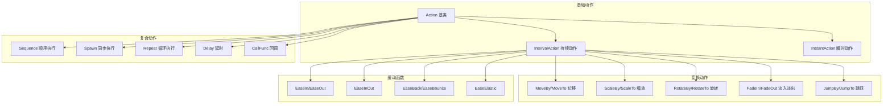

<div align="center">


<p align="center">
  <a href="https://github.com/Easy2D/Easy2D/releases/latest">
    
  </a>
  <a href="https://github.com/Easy2D/Easy2D/blob/master/LICENSE">
    
  </a>
  <a href="#">
    
  </a>
  <a href="#">
    
  </a>
  <a href="#">
    
  </a>
  <a href="#">
    
  </a>
  <a href="#">
    
  </a>
</p>

<p align="center">
  <b>🎮 为 C++ 打造的轻量级 2D 游戏引擎</b><br>
  <i>简单、高效、跨平台</i>
</p>

[📖 官方文档](https://easy2d.cn) | [🚀 快速开始](#快速开始) | [📦 构建安装](#构建安装) | [💬 QQ群: 608406540](#联系方式)

</div>

---

## 🌟 简介

**Easy2D v3.1.0** 是一个专为 C++ 设计的轻量级 2D 游戏引擎，采用全新架构设计，支持 Windows、Linux 和 macOS 三大平台。

> 💡 创建这个引擎的初衷是学习游戏引擎技术，并开发一些有趣的小游戏。Easy2D 提供了丰富的工具和轮子，让游戏开发变得简单而愉快。

### ✨ 核心特性

- **🎬 动画系统**：支持基于动作（Action）的补间动画和基于精灵图（Sprite Sheet）的帧动画。`AnimatedSprite` 提供完整的动画控制，包括播放、暂停、帧范围限制、动画字典管理等功能。

- **📜 脚本系统**：集成 Squirrel 脚本引擎，支持使用类 JavaScript 语法编写游戏逻辑。通过 `ScriptComponent` 将脚本附加到节点，实现数据驱动的游戏开发。提供完整的引擎 API 绑定，包括节点操作、输入处理、动画控制等。

- **🎮 跨平台**：一套代码，多平台运行。支持 Windows、Linux 和 macOS。

---

## 🗺️ 架构概览



### 🎬 动画系统详解

Easy2D 提供两套动画系统，满足不同场景需求：

**1. 动作系统（Action）**
- 基于补间动画的节点变换系统
- 支持位移、缩放、旋转、淡入淡出等基础动作
- 支持组合动作（Sequence/Spawn/Repeat）和缓动函数
- 适用于 UI 动画、特效动画等场景

**2. 精灵动画系统（AnimatedSprite）**
- 基于精灵图的帧动画系统
- 支持从网格创建动画（`createFromGrid`）
- 支持帧范围限制，实现多方向动画管理
- 支持动画字典，动态切换不同动画
- 提供完整的播放控制（play/pause/stop/reset）
- 适用于角色行走、攻击等游戏动画

### 📜 脚本系统详解

Easy2D v3.1.0 引入 Squirrel 脚本引擎，支持数据驱动的游戏开发：

**1. 脚本引擎（ScriptEngine）**
- 基于 Squirrel 3.2 稳定版
- 类 JavaScript 语法，易于学习
- 支持面向对象编程
- 提供完整的错误处理和调试信息

**2. 脚本组件（ScriptComponent）**
- 将脚本附加到场景节点
- 生命周期回调：`onEnter`、`onUpdate`、`onExit`
- 通过 `node` 参数访问和操附加的节点
- 支持自定义属性和方法

**3. 脚本绑定 API**
- **节点操作**：`Node`、`Sprite`、`AnimatedSprite` 等
- **输入处理**：`Input.isKeyDown()`、`Input.isKeyPressed()`
- **数学类型**：`Vec2`、`Rect`、`Color` 等
- **全局函数**：`log()` 日志输出

**示例脚本结构**：
```nut
return {
    function onEnter(node) {
        // 初始化：创建精灵、设置位置等
    }
    
    function onUpdate(node, dt) {
        // 每帧更新：处理输入、更新状态等
    }
    
    function onExit(node) {
        // 清理：释放资源等
    }
}
```

---

## ✨ 功能特性

### 🎬 核心功能

| 功能模块 | 描述 | 状态 |
|:--------:|:-----|:----:|
| 🎭 场景管理 | 灵活的场景切换与管理 | ✅ |
| 🎨 过渡动画 | 淡入淡出、移动、盒子等多种过渡效果 | ✅ |
| 🎬 动画系统 | 丰富的动作和帧动画支持 | ✅ |
| 📜 脚本系统 | Squirrel 脚本支持，可编写游戏逻辑 | ✅ |
| 🔘 GUI 系统 | 简单易用的按钮组件 | ✅ |
| 🎵 音频支持 | 基于 miniaudio 的音频播放 | ✅ |
| 💾 数据持久化 | 游戏数据保存与读取 | ✅ |
| 📝 日志系统 | 基于 spdlog 的高性能日志 | ✅ |
| 🌐 跨平台 | 支持 Windows/Linux/macOS | ✅ |
| 🚀 OpenGL 渲染 | 现代 OpenGL 渲染后端 | ✅ |
| 🎯 空间索引 | 四叉树/空间哈希碰撞检测 | ✅ |

### 🎯 动作系统详解



### 🖼️ 渲染流程


---

## 🚀 快速开始

### 环境要求

| 组件 | 最低版本 | 推荐版本 |
|:----:|:--------:|:--------:|
| Windows | Windows 7 | Windows 10/11 |
| Linux | Ubuntu 18.04 | Ubuntu 22.04 |
| macOS | 10.14 | 最新版 |
| C++ 标准 | C++17 | C++17 |
| OpenGL | 3.3 | 4.0+ |

### 使用 xmake 构建（推荐）

#### 步骤 1: 安装 xmake

```bash
# Windows (PowerShell)
Invoke-Expression (Invoke-Webrequest 'https://xmake.io/psget.text' -UseBasicParsing).Content

# Linux/macOS
curl -fsSL https://xmake.io/shget.text | bash
```

#### 步骤 2: 克隆并构建

```bash
# 克隆仓库
git clone https://github.com/nomango/easy2d.git
cd easy2d

# 配置并构建
xmake f --mode=release
xmake

# 运行示例
xmake run hello_world
xmake run push_box
```

#### 平台特定配置

```bash
# Windows (MSVC - 默认)
xmake f --mode=release

# Windows (MinGW)
xmake f --toolchain=mingw --mode=release

# Linux
xmake f --mode=release

# macOS
xmake f --mode=release

# 调试模式
xmake f --mode=debug
```

---

## 📝 Hello World 示例

```cpp
#include <easy2d/easy2d.h>

using namespace easy2d;

int main()
{
    // 初始化日志
    Logger::init();
    Logger::setLevel(LogLevel::Info);

    // 配置应用
    AppConfig config;
    config.title = "Hello Easy2D";
    config.width = 800;
    config.height = 600;
    config.vsync = true;

    // 初始化应用
    auto& app = Application::instance();
    if (!app.init(config)) {
        Logger::shutdown();
        return -1;
    }

    // 创建场景
    auto scene = makePtr<Scene>();
    scene->setBackgroundColor(Color(0.1f, 0.1f, 0.15f, 1.0f));

    // 创建文本节点
    auto text = Text::create("Hello, Easy2D v3.0!");
    text->setPosition(Vec2(400, 300));
    text->setAnchor(Vec2(0.5f, 0.5f));
    text->setTextColor(Color(1.0f, 0.5f, 0.2f, 1.0f));
    text->setFontSize(32);

    // 添加动画效果
    text->runAction(makePtr<Repeat>(
        makePtr<Sequence>(std::vector<Ptr<Action>>{
            makePtr<ScaleTo>(1.0f, Vec2(1.5f, 1.5f)),
            makePtr<ScaleTo>(1.0f, Vec2(1.0f, 1.0f))
        })
    ));

    // 添加到场景
    scene->addChild(text);

    // 进入场景
    app.enterScene(scene);

    // 运行主循环
    app.run();

    // 清理
    app.shutdown();
    Logger::shutdown();
    return 0;
}
```

### 脚本系统示例

```nut
// player_controller.nut - 角色控制器脚本
// 使用 WASD 控制角色移动和动画

local Direction = {
    Down = 0,   // 向下走 - 帧 0-3
    Left = 1,   // 向左走 - 帧 4-7
    Right = 2,  // 向右走 - 帧 8-11
    Up = 3      // 向上走 - 帧 12-15
}

return {
    character = null
    currentDir = Direction.Down
    isMoving = false
    moveSpeed = 150.0

    function onEnter(node) {
        // 创建动画精灵
        character = AnimatedSprite.createFromGrid(
            "player.png", 96, 96, 125.0, 16)
        
        // 设置初始帧范围（向下走：帧 0-3）
        character.setFrameRange(0, 3)
        character.setPosition(450.0, 300.0)
        
        node.addChild(character)
    }

    function onUpdate(node, dt) {
        isMoving = false

        // 处理输入
        if (Input.isKeyDown(Key.W)) {
            moveCharacter(Direction.Up, dt)
        } else if (Input.isKeyDown(Key.S)) {
            moveCharacter(Direction.Down, dt)
        } else if (Input.isKeyDown(Key.A)) {
            moveCharacter(Direction.Left, dt)
        } else if (Input.isKeyDown(Key.D)) {
            moveCharacter(Direction.Right, dt)
        }

        // 停止移动时暂停动画
        if (!isMoving && character.isPlaying()) {
            character.pause()
        }
    }

    function moveCharacter(dir, dt) {
        local frameStart = dir * 4
        local frameEnd = frameStart + 3

        // 方向改变时切换帧范围
        if (currentDir != dir) {
            character.setFrameRange(frameStart, frameEnd)
            character.setFrameIndex(frameStart)
        }

        if (!character.isPlaying()) {
            character.play()
        }

        currentDir = dir
        isMoving = true

        // 移动角色
        local pos = character.getPosition()
        switch (dir) {
            case Direction.Down:  pos.setY(pos.getY() + moveSpeed * dt); break
            case Direction.Up:    pos.setY(pos.getY() - moveSpeed * dt); break
            case Direction.Left:  pos.setX(pos.getX() - moveSpeed * dt); break
            case Direction.Right: pos.setX(pos.getX() + moveSpeed * dt); break
        }
        character.setPosition(pos.getX(), pos.getY())
    }
}
```

---

## 🏗️ 项目结构

```
Easy2D/
├── 📁 Easy2D/                    # 引擎核心代码
│   ├── 📁 include/               # 头文件
│   │   ├── 📁 easy2d/            # 引擎头文件
│   │   │   ├── easy2d.h          # 主头文件
│   │   │   ├── app/              # 应用管理
│   │   │   │   └── application.h
│   │   │   ├── action/           # 动作系统
│   │   │   │   ├── action.h
│   │   │   │   ├── actions.h
│   │   │   │   └── ease.h
│   │   │   ├── audio/            # 音频系统
│   │   │   │   ├── audio_engine.h
│   │   │   │   └── sound.h
│   │   │   ├── core/             # 核心类型
│   │   │   │   ├── types.h
│   │   │   │   ├── math_types.h
│   │   │   │   ├── color.h
│   │   │   │   └── string.h
│   │   │   ├── event/            # 事件系统
│   │   │   │   ├── event.h
│   │   │   │   ├── event_dispatcher.h
│   │   │   │   └── input_codes.h
│   │   │   ├── graphics/         # 图形渲染
│   │   │   │   ├── render_backend.h
│   │   │   │   ├── texture.h
│   │   │   │   ├── font.h
│   │   │   │   ├── camera.h
│   │   │   │   └── opengl/       # OpenGL 实现
│   │   │   ├── platform/         # 平台抽象
│   │   │   │   ├── window.h
│   │   │   │   └── input.h
│   │   │   ├── resource/         # 资源管理
│   │   │   │   └── resource_manager.h
│   │   │   ├── scene/            # 场景系统
│   │   │   │   ├── node.h
│   │   │   │   ├── scene.h
│   │   │   │   ├── sprite.h
│   │   │   │   ├── text.h
│   │   │   │   ├── shape_node.h
│   │   │   │   ├── scene_manager.h
│   │   │   │   └── transition.h
│   │   │   ├── spatial/          # 空间索引
│   │   │   │   ├── spatial_manager.h
│   │   │   │   ├── quadtree.h
│   │   │   │   └── spatial_hash.h
│   │   │   ├── script/           # 脚本系统
│   │   │   │   ├── script_engine.h
│   │   │   │   ├── script_component.h
│   │   │   │   └── sq_binding.h
│   │   │   ├── ui/               # UI 系统
│   │   │   │   ├── widget.h
│   │   │   │   └── button.h
│   │   │   └── utils/            # 工具库
│   │   │       ├── logger.h
│   │   │       ├── timer.h
│   │   │       ├── data.h
│   │   │       └── random.h
│   │   ├── 📁 glew/              # GLEW 库
│   │   ├── 📁 glfw/              # GLFW 库
│   │   ├── 📁 glm/               # GLM 数学库
│   │   ├── 📁 spdlog/            # spdlog 日志库
│   │   ├── 📁 stb/               # stb 图像库
│   │   ├── 📁 miniaudio/         # miniaudio 音频库
│   │   └── 📁 simpleini/         # simpleini 配置库
│   ├── 📁 src/                   # 源文件
│   │   ├── App/                  # 应用实现
│   │   ├── Action/               # 动作系统实现
│   │   ├── Animation/            # 动画系统实现
│   │   ├── Audio/                # 音频系统实现
│   │   ├── Core/                 # 核心实现
│   │   ├── Event/                # 事件系统实现
│   │   ├── Graphics/             # 图形渲染实现
│   │   ├── Platform/             # 平台实现
│   │   ├── Resource/             # 资源管理实现
│   │   ├── Scene/                # 场景系统实现
│   │   ├── Script/               # 脚本系统实现
│   │   ├── Spatial/              # 空间索引实现
│   │   ├── UI/                   # UI 系统实现
│   │   └── Utils/                # 工具库实现
│   └── 📁 examples/              # 示例程序
│       ├── hello_world/          # Hello World 示例
│       ├── animation_demo/       # 精灵动画示例
│       ├── script_demo/          # 脚本系统示例
│       ├── font_test/            # 字体测试示例
│       └── push_box/             # 推箱子游戏示例
├── 📁 logo/                      # Logo 资源
├── 📄 xmake.lua                  # xmake 构建配置
├── 📄 LICENSE                    # MIT 许可证
└── 📄 README.md                  # 本文件
```

---

## 📋 API 速查

### 应用控制

```cpp
// 获取应用实例
auto& app = Application::instance();

// 初始化
AppConfig config;
config.title = "My Game";
config.width = 800;
config.height = 600;
config.vsync = true;
app.init(config);

// 运行主循环
app.run();

// 状态控制
app.pause();
app.resume();
app.quit();

// 进入场景
app.enterScene(makePtr<MyScene>());
app.enterScene(makePtr<MyScene>(), makePtr<FadeTransition>(1.0f));

// 获取子系统
auto& input = app.input();
auto& audio = app.audio();
auto& resources = app.resources();
auto& timers = app.timers();
```

### 场景管理

```cpp
// 创建场景
auto scene = makePtr<Scene>();
scene->setBackgroundColor(Color(0.1f, 0.1f, 0.2f, 1.0f));

// 场景属性
scene->setViewportSize(800, 600);
scene->pause();
scene->resume();

// 空间索引
scene->setSpatialIndexingEnabled(true);
auto nodes = scene->queryNodesInArea(Rect(0, 0, 100, 100));
auto collisions = scene->queryCollisions();
```

### 节点操作

```cpp
// 创建节点
auto node = makePtr<Node>();
auto sprite = Sprite::create(texture);
auto text = Text::create("Hello");

// 变换属性
node->setPosition(Vec2(100, 200));
node->setPosition(100, 200);
node->setRotation(45.0f);
node->setScale(Vec2(2.0f, 2.0f));
node->setScale(2.0f);
node->setAnchor(Vec2(0.5f, 0.5f));
node->setOpacity(0.8f);
node->setVisible(true);
node->setZOrder(10);

// 层级管理
parent->addChild(child);
parent->removeChild(child);
child->removeFromParent();
auto found = parent->getChildByName("player");
auto found = parent->getChildByTag(100);

// 世界变换
auto worldPos = node->convertToWorldSpace(Vec2(0, 0));
auto localPos = node->convertToNodeSpace(worldPos);
auto transform = node->getWorldTransform();

// 空间索引
node->setSpatialIndexed(true);
node->updateSpatialIndex();
auto bounds = node->getBoundingBox();
```

### 动作系统

```cpp
// 创建动作
auto move = makePtr<MoveTo>(1.0f, Vec2(100, 200));
auto scale = makePtr<ScaleTo>(0.5f, Vec2(2.0f, 2.0f));
auto rotate = makePtr<RotateBy>(1.0f, 90.0f);
auto fade = makePtr<FadeIn>(0.5f);
auto jump = makePtr<JumpBy>(1.0f, Vec2(100, 0), 50.0f, 3);

// 组合动作
auto sequence = makePtr<Sequence>(std::vector<Ptr<Action>>{
    move, scale, rotate
});
auto spawn = makePtr<Spawn>(std::vector<Ptr<Action>>{
    move, fade
});
auto repeat = makePtr<Repeat>(sequence);
auto repeatForever = makePtr<RepeatForever>(rotate);

// 缓动
auto easeMove = makePtr<EaseInOut>(move, 2.0f);

// 运行动作
node->runAction(action);
node->stopAllActions();
node->stopAction(action);
node->stopActionByTag(1);
```

### 输入处理

```cpp
auto& input = app.input();

// 键盘
if (input.isKeyDown(KeyCode::Space)) {}
if (input.isKeyPressed(KeyCode::Enter)) {}
if (input.isKeyReleased(KeyCode::Escape)) {}

// 鼠标
if (input.isMouseDown(MouseButton::Left)) {}
if (input.isMousePressed(MouseButton::Right)) {}
auto pos = input.getMousePosition();
auto delta = input.getMouseDelta();
auto scroll = input.getMouseScrollDelta();

// 鼠标控制
input.setMousePosition(Vec2(400, 300));
input.setMouseVisible(false);
input.setMouseLocked(true);
```

### 音频播放

```cpp
auto& audio = app.audio();

// 加载音效
auto sound = audio.loadSound("jump.wav");
auto namedSound = audio.loadSound("jump", "jump.wav");

// 播放控制
sound->play();
sound->pause();
sound->resume();
sound->stop();

// 属性
sound->setVolume(0.8f);
sound->setLooping(true);
sound->setPitch(1.2f);

// 全局控制
audio.setMasterVolume(0.5f);
audio.pauseAll();
audio.resumeAll();
audio.stopAll();
```

### 资源管理

```cpp
auto& resources = app.resources();

// 添加搜索路径
resources.addSearchPath("assets");
resources.addSearchPath("assets/images");

// 加载纹理
auto texture = resources.loadTexture("player.png");
auto texture = resources.loadTexture("atlas.png", Rect(0, 0, 32, 32));

// 加载字体
auto font = resources.loadFont("arial.ttf", 16);

// 创建精灵
auto sprite = Sprite::create(texture);
```

### UI 系统

```cpp
// 创建按钮
auto button = Button::create();
button->setText("Click Me");
button->setPosition(Vec2(400, 300));
button->setTextColor(Color::White);
button->setFontSize(24);

// 背景设置
button->setBackgroundColor(
    Color(0.2f, 0.4f, 0.8f, 1.0f),  // normal
    Color(0.3f, 0.5f, 0.9f, 1.0f),  // hover
    Color(0.1f, 0.3f, 0.7f, 1.0f)   // pressed
);
button->setCornerRadius(8.0f);

// 点击回调
button->setOnClick([]() {
    Logger::info("Button clicked!");
});

scene->addChild(button);
```

### 定时器

```cpp
auto& timers = app.timers();

// 单次定时器
auto id = timers.addTimer(2.0f, []() {
    Logger::info("Timer fired!");
});

// 重复定时器
auto id = timers.addRepeatingTimer(1.0f, []() {
    Logger::info("Every second!");
});

// 控制
timers.pauseTimer(id);
timers.resumeTimer(id);
timers.cancelTimer(id);
```

### 数据持久化

```cpp
// 保存数据
Data data;
data.setInt("score", 1000);
data.setFloat("volume", 0.8f);
data.setBool("fullscreen", true);
data.setString("player", "Alice");
data.save("savegame.dat");

// 加载数据
Data data;
if (data.load("savegame.dat")) {
    int score = data.getInt("score", 0);
    float volume = data.getFloat("volume", 1.0f);
}
```

---

## 🛠️ 技术栈

| 技术 | 用途 | 版本 |
|:----:|:-----|:----:|
| OpenGL | 2D 图形渲染 | 3.3+ |
| GLFW | 窗口和输入管理 | 3.3+ |
| GLEW | OpenGL 扩展加载 | 2.1+ |
| GLM | 数学库 | 0.9.9+ |
| miniaudio | 音频播放 | 最新版 |
| spdlog | 日志系统 | 最新版 |
| stb_image | 图像加载 | 最新版 |
| xmake | 构建系统 | 2.5+ |

---

## 📦 使用 xmake 集成 Easy2D

在你的项目中使用 Easy2D：

```lua
-- xmake.lua
add_rules("mode.debug", "mode.release")

-- 添加 Easy2D 仓库
add_repositories("easy2d https://github.com/ChestnutYueyue/xmake-repo")

-- 添加依赖
add_requires("easy2d")

target("mygame")
    set_kind("binary")
    set_languages("c++17")
    add_files("src/*.cpp")
    add_packages("easy2d")
target_end()
```

---

## 🤝 贡献

欢迎提交 Issue 和 Pull Request！

---

## 📄 许可证

Easy2D 使用 [MIT](LICENSE) 许可证。

---

## 联系方式

- QQ群: 608406540
- GitHub: https://github.com/Easy2D/Easy2D
