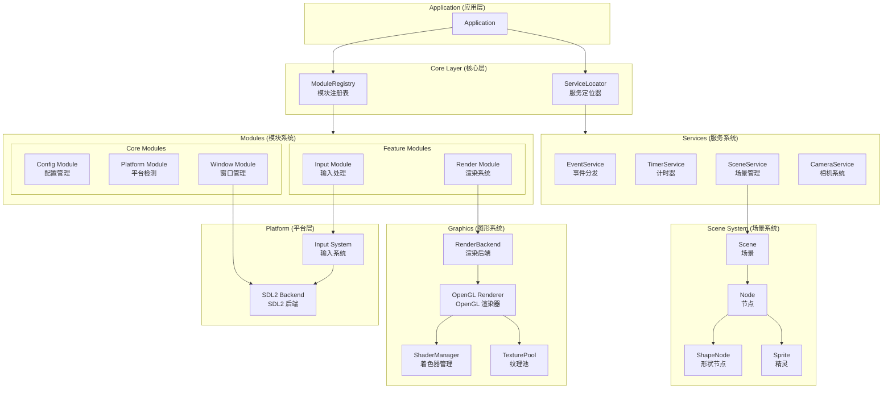

<div align="center">

# Extra2D

<p align="center">
  <a href="#">
    
  </a>
  <a href="#">
    
  </a>
  <a href="#">
    
  </a>
  <a href="#">
    
  </a>
  <a href="#">
    
  </a>
</p>

<p align="center">
  <b>轻量级跨平台 2D 游戏引擎</b><br>
  <i>高性能、模块化、支持 Nintendo Switch</i>
</p>

[构建指南](#构建指南) | [快速开始](#快速开始) | [示例程序](#示例程序) | [模块系统](./docs/module_system.md)

</div>

---

## 简介

**Extra2D** 是一个轻量级跨平台 2D 游戏引擎，采用现代 C++17 架构，支持 Windows、Linux、macOS 和 Nintendo Switch 平台。

### 核心特性

- **跨平台支持**：Windows、Linux、macOS、Nintendo Switch
- **模块化架构**：模块系统 + 服务系统，灵活可扩展
- **场景图系统**：树形节点结构，支持变换继承
- **输入系统**：键盘、鼠标、手柄、触摸，事件驱动
- **渲染系统**：OpenGL ES 3.2，支持自定义着色器
- **视口适配**：多种适配模式，自动响应窗口大小变化
- **音频系统**：高质量音频播放（规划中）
- **UI 系统**：完整的 UI 控件支持（规划中）

---

## 架构概览



### 模块系统

| 模块 | 职责 | 优先级 |
|-----|------|-------|
| Config | 配置管理 | Core (0) |
| Platform | 平台检测 | Core (0) |
| Window | 窗口管理 | Core (0) |
| Input | 输入处理 | Input (50) |
| Render | 渲染系统 | Graphics (100) |

### 服务系统

| 服务 | 职责 | 优先级 |
|-----|------|-------|
| EventService | 事件分发 | 100 |
| TimerService | 计时器 | 200 |
| SceneService | 场景管理 | 300 |
| CameraService | 相机系统 | 400 |

---

## 构建指南

### 环境要求

| 组件 | 要求 |
|:----:|:-----|
| 编译器 | GCC 9+ / Clang 10+ / MSVC 2019+ |
| C++ 标准 | C++17 |
| 构建工具 | xmake 2.5+ |
| 目标平台 | Windows / Linux / macOS / Nintendo Switch |

### 安装 xmake

```powershell
# Windows (PowerShell)
Invoke-Expression (Invoke-WebRequest 'https://xmake.io/psget.text' -UseBasicParsing).Content
```

```bash
# macOS
brew install xmake

# Linux
sudo add-apt-repository ppa:xmake-io/xmake
sudo apt update
sudo apt install xmake
```

### 构建项目

```bash
# 配置项目
xmake f -p mingw -a x86_64 -m release -y

# 构建
xmake build

# 运行示例
xmake run demo_basic
```

### Nintendo Switch 构建

```bash
# 设置 devkitPro 环境
export DEVKITPRO=/opt/devkitpro

# 配置并构建
xmake f -p switch -m release -y
xmake build
```

---

## 快速开始

### 创建应用

```cpp
#include <extra2d/extra2d.h>

using namespace extra2d;

int main() {
    // 配置应用
    AppConfig config = AppConfig::createDefault();
    config.appName = "My Game";
    config.appVersion = "1.0.0";
    
    // 初始化
    Application& app = Application::get();
    if (!app.init(config)) {
        return -1;
    }
    
    // 创建场景
    auto scene = Scene::create();
    scene->setBackgroundColor(Color(0.1f, 0.1f, 0.15f, 1.0f));
    scene->setViewportSize(app.window().width(), app.window().height());
    
    // 配置视口适配
    auto cameraService = app.camera();
    if (cameraService) {
        ViewportConfig vpConfig;
        vpConfig.logicWidth = app.window().width();
        vpConfig.logicHeight = app.window().height();
        vpConfig.mode = ViewportMode::AspectRatio;
        cameraService->setViewportConfig(vpConfig);
    }
    
    // 运行场景
    app.enterScene(scene);
    app.run();
    
    // 清理
    app.shutdown();
    return 0;
}
```

### 场景图示例

```cpp
// 创建节点层级
auto root = makeShared<Node>();
root->setPos(width / 2, height / 2);
scene->addChild(root);

// 添加形状节点
auto rect = ShapeNode::createFilledRect(
    Rect(-50, -50, 100, 100), 
    Color(1.0f, 0.4f, 0.4f, 1.0f)
);
root->addChild(rect);

// 变换继承
auto child = makeShared<Node>();
child->setPos(100, 0);
child->setRotation(45);    // 旋转 45 度
child->setScale(0.5f);     // 缩放 0.5
root->addChild(child);
```

### 输入事件

```cpp
auto eventService = app.events();

// 键盘事件
eventService->addListener(EventType::KeyPressed, [](Event& e) {
    auto& key = std::get<KeyEvent>(e.data);
    if (key.keyCode == static_cast<int>(Key::Escape)) {
        Application::get().quit();
    }
});

// 鼠标事件
eventService->addListener(EventType::MouseButtonPressed, [](Event& e) {
    auto& mouse = std::get<MouseButtonEvent>(e.data);
    // 处理鼠标点击
});

// 手柄事件
eventService->addListener(EventType::GamepadButtonPressed, [](Event& e) {
    auto& gamepad = std::get<GamepadButtonEvent>(e.data);
    // 处理手柄输入
});
```

---

## 示例程序

| 示例 | 说明 |
|-----|------|
| `demo_basic` | 基础示例：场景图、输入事件、视口适配 |

运行示例：

```bash
xmake run demo_basic
```

---

## 技术栈

| 技术 | 用途 | 版本 |
|:----:|:-----|:----:|
| OpenGL ES | 2D 图形渲染 | 3.2 |
| SDL2 | 窗口和输入管理 | 2.0+ |
| GLM | 数学库 | 0.9.9+ |
| nlohmann_json | JSON 解析 | 3.x |
| glad | OpenGL 加载器 | 最新版 |
| stb_image | 图像加载 | 最新版 |
| stb_truetype | 字体渲染 | 最新版 |
| xmake | 构建系统 | 2.5+ |

---

## 文档

- [模块系统文档](./docs/module_system.md) - 模块系统、服务系统、场景图、视口适配

---

## 目录结构

```
Extra2D/
├── Extra2D/
│   ├── include/
│   │   ├── KHR/                    # KHR 平台头文件
│   │   ├── extra2d/                # 引擎公共头文件
│   │   │   ├── app/                # 应用程序
│   │   │   ├── audio/              # 音频配置
│   │   │   ├── config/             # 配置系统
│   │   │   ├── core/               # 核心类型
│   │   │   ├── debug/              # 调试配置
│   │   │   ├── event/              # 事件系统
│   │   │   ├── graphics/           # 图形渲染
│   │   │   │   └── opengl/         # OpenGL 实现
│   │   │   ├── input/              # 输入配置
│   │   │   ├── platform/           # 平台抽象
│   │   │   ├── resource/           # 资源配置
│   │   │   ├── scene/              # 场景系统
│   │   │   ├── services/           # 服务接口
│   │   │   └── utils/              # 工具库
│   │   ├── glad/                   # OpenGL 加载器
│   │   └── stb/                    # STB 单文件库
│   ├── shaders/                    # 着色器文件
│   │   ├── builtin/                # 内置着色器
│   │   ├── common/                 # 公共着色器代码
│   │   └── effects/                # 特效着色器
│   └── src/                        # 源文件
│       ├── app/                    # 应用实现
│       ├── config/                 # 配置实现
│       ├── core/                   # 核心实现
│       ├── debug/                  # 调试实现
│       ├── event/                  # 事件实现
│       ├── glad/                   # GLAD 实现
│       ├── graphics/               # 图形实现
│       │   └── opengl/             # OpenGL 实现
│       ├── platform/               # 平台实现
│       │   └── backends/           # 后端实现
│       │       └── sdl2/           # SDL2 后端
│       ├── resource/               # 资源实现
│       ├── scene/                  # 场景实现
│       ├── services/               # 服务实现
│       └── utils/                  # 工具实现
├── docs/                           # 文档
├── examples/                       # 示例程序
│   └── basic/                      # 基础示例
└── xmake/                          # 构建配置
    └── toolchains/                 # 工具链配置
```

---

## 平台支持

| 平台 | 窗口后端 | 图形 API | 状态 |
|-----|---------|---------|------|
| Windows | SDL2 | OpenGL ES 3.2 | ✅ 支持 |
| Linux | SDL2 | OpenGL ES 3.2 | ✅ 支持 |
| macOS | SDL2 | OpenGL ES 3.2 | ✅ 支持 |
| Nintendo Switch | SDL2 | OpenGL ES 3.2 | ✅ 支持 |

---

## 贡献

欢迎提交 Issue 和 Pull Request！

---

## 许可证

Extra2D 使用 [MIT](LICENSE) 许可证。

---

## 联系方式

- GitHub Issues: https://github.com/ChestnutYueyue/extra2d/issues
