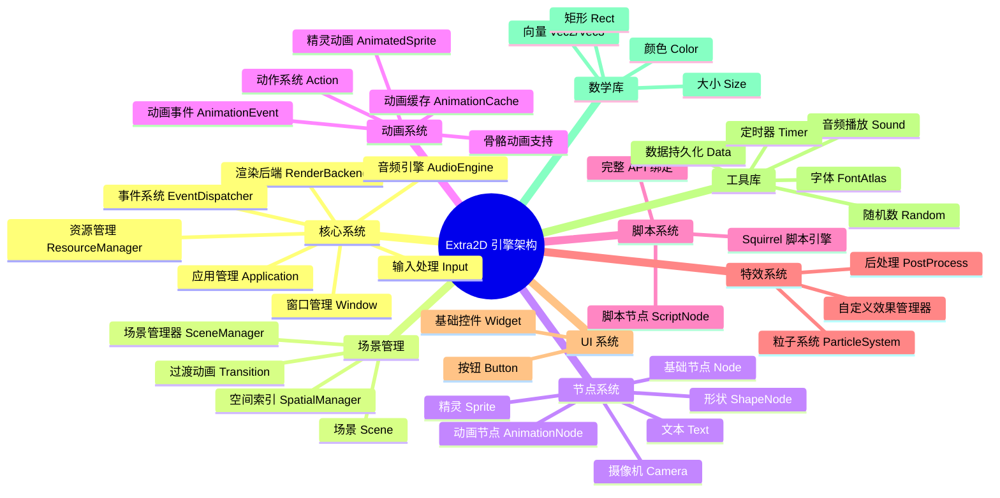

<div align="center">


<p align="center">
  <a href="https://github.com/ChestnutYueyue/extra2d/releases/latest">
    
  </a>
  <a href="https://github.com/ChestnutYueyue/extra2d/blob/master/LICENSE">
    
  </a>
  <a href="#">
    
  </a>
  <a href="#">
    
  </a>
  <a href="#">
    
  </a>
</p>

<p align="center">
  <b>🎮 专为 Nintendo Switch 打造的轻量级 2D 游戏引擎</b><br>
  <i>高性能、易用、原生支持 Switch 平台</i>
</p>

[📖 构建指南](./SWITCH_BUILD_GUIDE.md) | [🚀 快速开始](#快速开始) | [📦 项目结构](#项目结构) | [💬 问题反馈](https://github.com/ChestnutYueyue/extra2d/issues)

</div>

---

## 🌟 简介

**Extra2D** 是一个专为 **Nintendo Switch** 平台设计的轻量级 2D 游戏引擎，采用现代 C++17 架构，充分利用 Switch 硬件特性，为开发者提供流畅的游戏开发体验。

> 💡 Extra2D 的诞生是为了让 Switch 独立游戏开发变得更加简单高效。无论是复古风格的像素游戏，还是现代化的 2D 作品，Extra2D 都能提供强大的支持。

### ✨ 核心特性

- **🎯 Switch 原生支持**：专为 Nintendo Switch 硬件优化，支持掌机/主机双模式
- **🎬 高级动画系统**：支持骨骼动画、精灵动画、补间动画，提供 ALS 动画格式支持
- **📜 脚本系统**：集成 Squirrel 脚本引擎，支持热更新和快速迭代开发
- **🎵 音频系统**：基于 SDL2 的高质量音频播放，支持 BGM 和音效
- **🎨 特效系统**：粒子系统、后处理效果、自定义着色器支持
- **💾 数据持久化**：游戏存档、配置文件的便捷读写

---

## 🗺️ 架构概览



---

## 🚀 快速开始

### 环境要求

| 组件 | 要求 |
|:----:|:-----|
| 开发环境 | devkitPro + devkitA64 |
| C++ 标准 | C++17 |
| 构建工具 | xmake |
| 目标平台 | Nintendo Switch |

### 安装 devkitPro

```bash
# Windows (以管理员身份运行 PowerShell)
Invoke-WebRequest -Uri "https://github.com/devkitPro/pacman/releases/latest/download/devkitpro-pacman.amd64.exe" -OutFile "devkitpro-pacman.exe"
.\devkitpro-pacman.exe

# 安装 Switch 开发工具链
pacman -S switch-dev switch-portlibs
```

### 构建项目

```bash
# 克隆仓库
git clone https://github.com/ChestnutYueyue/extra2d.git
cd extra2d

# 配置 Switch 平台构建
xmake f -p switch --mode=release

# 构建引擎
xmake

# 构建示例游戏
xmake -g examples
```

### 生成 NSP 可运行文件

```bash
# 打包推箱子游戏示例
xmake package push_box

# 生成的文件位于
# build/switch/release/push_box/push_box.nsp
```

---

## 📝 Hello World 示例

```cpp
#include <extra2d/extra2d.h>

using namespace extra2d;

int main()
{
    // 初始化日志
    Logger::init();
    Logger::setLevel(LogLevel::Info);

    // 配置应用
    AppConfig config;
    config.title = "Hello Extra2D";
    config.width = 1280;
    config.height = 720;
    config.vsync = true;

    // 初始化应用
    auto& app = Application::instance();
    if (!app.init(config)) {
        Logger::shutdown();
        return -1;
    }

    // 创建场景
    auto scene = makePtr<Scene>();
    scene->setBackgroundColor(Color(0.1f, 0.1f, 0.15f, 1.0f));

    // 创建文本节点
    auto text = Text::create("Hello, Extra2D on Switch!");
    text->setPosition(Vec2(640, 360));
    text->setAnchor(Vec2(0.5f, 0.5f));
    text->setTextColor(Color(1.0f, 0.5f, 0.2f, 1.0f));
    text->setFontSize(48);

    // 添加动画效果
    text->runAction(makePtr<Repeat>(
        makePtr<Sequence>(std::vector<Ptr<Action>>{
            makePtr<ScaleTo>(1.0f, Vec2(1.5f, 1.5f)),
            makePtr<ScaleTo>(1.0f, Vec2(1.0f, 1.0f))
        })
    ));

    // 添加到场景
    scene->addChild(text);

    // 进入场景
    app.enterScene(scene);

    // 运行主循环
    app.run();

    // 清理
    app.shutdown();
    Logger::shutdown();
    return 0;
}
```

---

## 🏗️ 项目结构

```
Extra2D/
├── 📁 Extra2D/                   # 引擎核心代码
│   ├── 📁 include/               # 头文件
│   │   └── 📁 extra2d/           # 引擎头文件
│   │       ├── extra2d.h         # 主头文件
│   │       ├── app/              # 应用管理
│   │       ├── action/           # 动作系统
│   │       ├── animation/        # 动画系统
│   │       ├── audio/            # 音频系统
│   │       ├── core/             # 核心类型
│   │       ├── effects/          # 特效系统
│   │       ├── event/            # 事件系统
│   │       ├── graphics/         # 图形渲染
│   │       ├── platform/         # 平台抽象
│   │       ├── resource/         # 资源管理
│   │       ├── scene/            # 场景系统
│   │       ├── script/           # 脚本系统
│   │       ├── spatial/          # 空间索引
│   │       ├── ui/               # UI 系统
│   │       └── utils/            # 工具库
│   ├── 📁 src/                   # 源文件
│   └── 📁 examples/              # 示例程序
│       ├── push_box/             # 推箱子游戏
│       └── switch_simple_test/   # 简单测试
├── 📁 squirrel/                  # Squirrel 脚本引擎
├── 📁 logo/                      # Logo 资源
├── 📄 xmake.lua                  # xmake 构建配置
├── 📄 SWITCH_BUILD_GUIDE.md      # Switch 构建详细指南
├── 📄 LICENSE                    # MIT 许可证
└── 📄 README.md                  # 本文件
```

---

## 🎮 Switch 特定功能

### 双模式支持

```cpp
// 检测当前模式
if (app.isDocked()) {
    // 主机模式：可使用更高分辨率
    config.width = 1920;
    config.height = 1080;
} else {
    // 掌机模式
    config.width = 1280;
    config.height = 720;
}
```

### 控制器输入

```cpp
auto& input = app.input();

// Joy-Con 支持
if (input.isKeyDown(KeyCode::ButtonA)) {
    // A 键按下
}

if (input.isKeyDown(KeyCode::ButtonLeft)) {
    // 左摇杆向左
}
```

### ROMFS 资源加载

```cpp
// 自动从 ROMFS 加载资源
auto texture = resources.loadTexture("romfs:/images/player.png");
auto sound = audio.loadSound("romfs:/audio/jump.wav");
```

---

## 📋 API 速查

### 应用控制

```cpp
auto& app = Application::instance();
app.init(config);
app.run();
app.quit();
```

### 场景管理

```cpp
auto scene = makePtr<Scene>();
app.enterScene(scene);
app.enterScene(scene, makePtr<FadeTransition>(1.0f));
```

### 节点操作

```cpp
auto sprite = Sprite::create(texture);
sprite->setPosition(Vec2(100, 200));
sprite->setRotation(45.0f);
sprite->runAction(makePtr<MoveTo>(1.0f, Vec2(200, 300)));
```

### 动画系统

```cpp
// 精灵动画
auto anim = AnimatedSprite::createFromGrid(
    "player.png", 96, 96, 125.0f, 16);
anim->setFrameRange(0, 3);
anim->play();

// 动作动画
node->runAction(makePtr<Sequence>(
    makePtr<MoveTo>(1.0f, Vec2(100, 200)),
    makePtr<ScaleTo>(0.5f, Vec2(2.0f, 2.0f))
));
```

### 输入处理

```cpp
auto& input = app.input();
if (input.isKeyDown(KeyCode::ButtonA)) {}
if (input.isKeyPressed(KeyCode::ButtonB)) {}
auto pos = input.getMousePosition();
```

### 音频播放

```cpp
auto& audio = app.audio();
auto sound = audio.loadSound("jump.wav");
sound->play();
sound->setVolume(0.8f);
```

---

## 🛠️ 技术栈

| 技术 | 用途 | 版本 |
|:----:|:-----|:----:|
| OpenGL | 2D 图形渲染 | ES 3.0+ |
| GLFW | 窗口和输入管理 | 3.3+ |
| GLM | 数学库 | 0.9.9+ |
| miniaudio | 音频播放 | 最新版 |
| spdlog | 日志系统 | 最新版 |
| stb_image | 图像加载 | 最新版 |
| Squirrel | 脚本引擎 | 3.2+ |
| xmake | 构建系统 | 2.5+ |

---

## 📖 相关文档

- [Switch 构建指南](./SWITCH_BUILD_GUIDE.md) - 详细的 Switch 平台构建教程
- [迁移完成记录](./SWITCH_MIGRATION_COMPLETE.md) - 项目迁移历史记录

---

## 🤝 贡献

欢迎提交 Issue 和 Pull Request！

---

## 📄 许可证

Extra2D 使用 [MIT](LICENSE) 许可证。

---

## 联系方式

- GitHub Issues: https://github.com/ChestnutYueyue/extra2d/issues
- 作者: [ChestnutYueyue](https://github.com/ChestnutYueyue)
