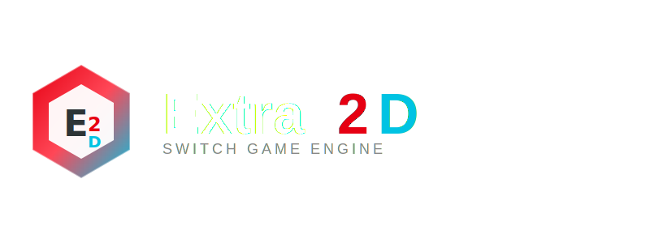
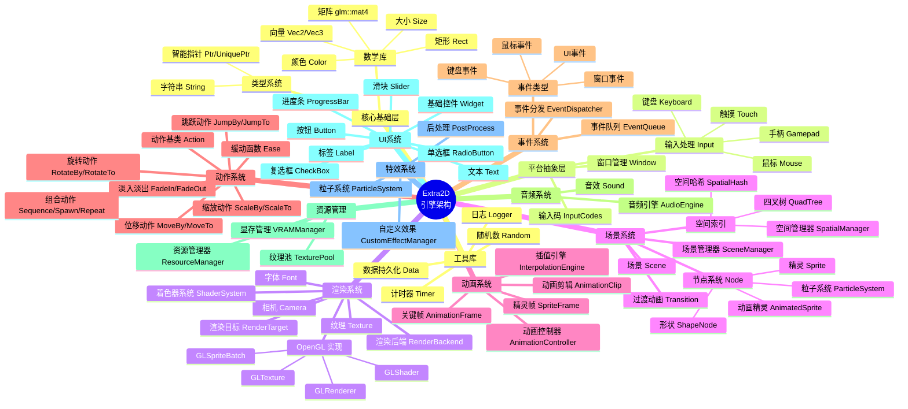

<div align="center">



<p align="center">
  <a href="https://github.com/ChestnutYueyue/extra2d/releases/latest">
    
  </a>
  <a href="https://github.com/ChestnutYueyue/extra2d/blob/master/LICENSE">
    
  </a>
  <a href="#">
    
  </a>
  <a href="#">
    
  </a>
  <a href="#">
    
  </a>
</p>

<p align="center">
  <b>🎮 专为 Nintendo Switch 打造的轻量级 2D 游戏引擎</b><br>
  <i>高性能、易用、原生支持 Switch 平台</i>
</p>

[📖 构建指南](./docs/Extra2D%20构建系统文档.md) | [🚀 快速开始](#快速开始) | [📦 示例程序](#示例程序) | [📚 API 教程](./docs/API_Tutorial/01_Quick_Start.md)

</div>

---

## 🌟 简介

**Extra2D** 是一个专为 **Nintendo Switch** 平台设计的轻量级 2D 游戏引擎，采用现代 C++17 架构，充分利用 Switch 硬件特性，为开发者提供流畅的游戏开发体验。

> 💡 Extra2D 的诞生是为了让 Switch 独立游戏开发变得更加简单高效。无论是复古风格的像素游戏，还是现代化的 2D 作品，Extra2D 都能提供强大的支持。

### ✨ 核心特性

- **🎯 Switch 原生支持**：专为 Nintendo Switch 硬件优化，支持掌机/主机双模式
- **🎬 高级动画系统**：支持骨骼动画、精灵动画、补间动画
- **🎵 音频系统**：基于 SDL2_mixer 的高质量音频播放，支持 BGM 和音效
- **🎨 渲染系统**：基于 OpenGL ES 的 2D 渲染，支持自定义着色器
- **💾 数据持久化**：游戏存档、配置文件的便捷读写
- **🔧 空间索引**：内置四叉树和空间哈希碰撞检测系统
- **🖱️ UI 系统**：完整的 UI 控件支持（按钮、文本、滑块等）

---

## 🚀 快速开始

### 环境要求

| 组件 | 要求 |
|:----:|:-----|
| 开发环境 | devkitPro + devkitA64 (Switch) / MinGW-w64 (Windows) |
| C++ 标准 | C++17 |
| 构建工具 | xmake |
| 目标平台 | Nintendo Switch / Windows (MinGW) |

### 安装 xmake

```bash
# Windows (PowerShell)
Invoke-Expression (Invoke-WebRequest 'https://xmake.io/psget.text' -UseBasicParsing).Content

# macOS
brew install xmake

# Linux
sudo add-apt-repository ppa:xmake-io/xmake
sudo apt update
sudo apt install xmake
```

## 📚 文档

- [📖 API 教程](./docs/API_Tutorial/01_Quick_Start.md) - 完整的 API 使用教程
  - [01. 快速开始](./docs/API_Tutorial/01_Quick_Start.md)
  - [02. 场景系统](./docs/API_Tutorial/02_Scene_System.md)
  - [03. 节点系统](./docs/API_Tutorial/03_Node_System.md)
  - [04. 资源管理](./docs/API_Tutorial/04_Resource_Management.md)
  - [05. 输入处理](./docs/API_Tutorial/05_Input_Handling.md)
  - [06. 碰撞检测](./docs/API_Tutorial/06_Collision_Detection.md)
  - [07. UI 系统](./docs/API_Tutorial/07_UI_System.md)
  - [08. 音频系统](./docs/API_Tutorial/08_Audio_System.md)
- [🔧 构建系统文档](./docs/Extra2D%20构建系统文档.md) - 详细的构建系统说明

---

## 🏗️ 架构概览



## 🛠️ 技术栈

| 技术 | 用途 | 版本 |
|:----:|:-----|:----:|
| OpenGL ES | 2D 图形渲染 | 3.0+ |
| GLFW | 窗口和输入管理 | 3.3+ |
| GLM | 数学库 | 0.9.9+ |
| SDL2_mixer | 音频播放 | 2.0+ |
| spdlog | 日志系统 | 最新版 |
| stb_image | 图像加载 | 最新版 |
| freetype | 字体渲染 | 最新版 |
| xmake | 构建系统 | 2.5+ |

---

## 🤝 贡献

欢迎提交 Issue 和 Pull Request！

---

## 📄 许可证

Extra2D 使用 [MIT](LICENSE) 许可证。

---

## 联系方式

- GitHub Issues: https://github.com/ChestnutYueyue/extra2d/issues
- 作者: [ChestnutYueyue](https://github.com/ChestnutYueyue)
